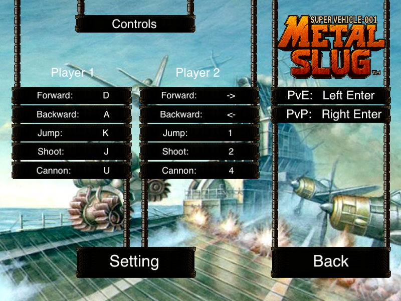

# ECE385-FA22

ECE 385: Digital Systems Laboratory is host by UIUC. This repository is supported by **Xuanbo Jin** major in EE and **Ximo Wang** major in EE. 

The repository contains all manuals, codes, and report for every lab. All labs are mainly programmed by SystemVerilog on Quartus, some IO parts for Avalon bus are programmed in C.

In the final ECE 385 project we complemented a simplified version of Metal Slug, a classic pixel style shooting game. We accomplished two modes, the original PvE mode and our own PvP mode. The controls are as below:

Here is the links to the PvP mode and PvE mode tests, please download them to watch:

- [PvP](FinalProject/PvP_testvideo.mp4)
- [PvE](FinalProject/PvE_testvideo.mp4) 

The link to the report of the Final Project is [Final Report](FinalProject/Final_Project.pdf), which contains all functionalities and how we complemented them, including:

- Motions of Marco: move forwards or backwards, jump, bullet shoot, cannon attack and die
- Motions of Enemy: move forwards or backwards, run ahead to the target, knife attack and die.
- PvP & PvE modes
- PNG to TXT transfer
- Keyborad IO and VGA Display
- Top level Block Diagram and IP interface
- Obstacles and potential extensions

